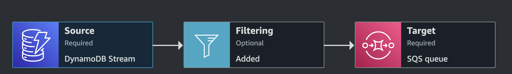

# AWS EventBridge Pipes

Los pipes nos permiten aplicar un pipeline de ingestión, filtrado, enriquecimiento y transformación entre un origen y destino.

Las etapas del mismo son las siguientes:

- **Ingestión**: se conecta a un source e ingesta eventos del mismo.
- **Filtrado (opcional)**: filtra los eventos ingestados mediante pattern matching.
- **Enriquecimiento (opcional)**: agrega información que la data ingestada no tiene desde su origen.
- **Transformación**: transforma el evento ingestado mediante un transformer

## Ejemplo de consumo de eventos de DynamoDB stream via EB Pipes

En el archivo `pipe.tf` se encuentra la implementación en Terraform del siguiente diagrama:



Básicamente es un pipe conectado a un ddb stream que filtra los eventos de tipo `INSERT`, transforma el input y lo envía hacia una queue SQS.

### Explicación

Primero, para que todo funcione es necesario que el stream de la tabla esté activo. Para ello, debemos validar si las siguientes líneas están o sino agregarlas.

```hcl
stream_enabled   = true
stream_view_type = "NEW_AND_OLD_IMAGES"
```

#### Estructura básica

Para crear el pipe debemos seguir la siguiente estructura:

```hcl
resource "aws_pipes_pipe" "<nombre_del_recurso> {
    name = "<nombre_del_pipe>"
    source = "<source_arn>"
    target = "<target_arn>"
    role_arn = "<pipe_role_arn>"

    source_parameters {
        dynamodb_stream_parameters {
            # aca podemos configurar el batch size, batch window, etc...
        }
        filter_criteria {
            # acá aplicamos filtros sobre el evento de origen
        }
    }

    target_parameters {
        input_template = "" # transformer
    }

    depends_on = [
        ...todos los recursos que deben ser deployados antes del pipe
    ]
}
```

En `source` debe ir el ARN del stream de DynamoDB, mientras que en `target` debe ir el ARN del recurso que se quiere especificar como destino (SQS, EventBridge Bus, SNS, etc...)

#### Filtrado (opcional)

Este paso es importante ya que AWS nos cobra solo por evento consumido después del filtrado. Si queremos optimizar esto, podemos aplicar filtros dentro de los `source_parameters` en el campo `filter_criteria`.

Por ejemplo, si queremos filtrar solo los eventos de tipo `INSERT` en el stream, debemos hacer lo siguiente:

```hcl
filter_criteria {
  filter {
    pattern = jsonencode({
        "eventName" : ["INSERT"]
    })
  }
}
```

### Transformación

Podemos transformar nuestro evento para que sea consumido de una manera más sencilla por los consumidores especificando el transformer en el campo `input_template` de los `target_parameters`.

```hcl
target_parameters {
    input_template = "{\"user_uuid\":\"<$.dynamodb.NewImage.id.S>\",\"operation_id\":\"<$.dynamodb.NewImage.operation_id.S>\"}"
  }
```

`$` simboliza al evento del source

### IMPORTANTE

Para que todo funcione, el rol del pipe debe tener las policies necesarias para consumir del stream de dynamo (source) y enviar mensajes al destino.
